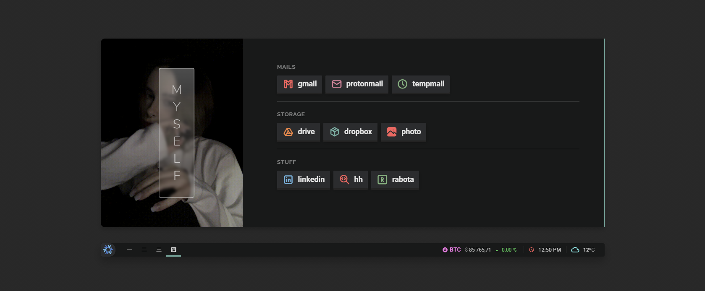
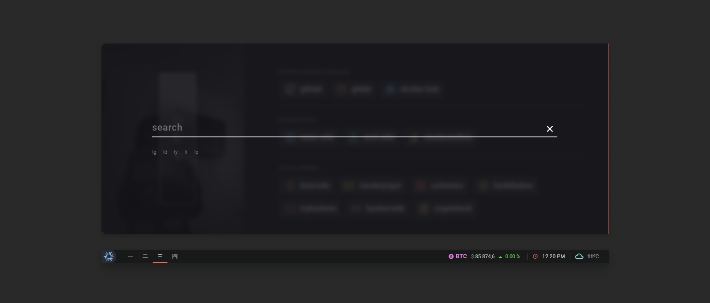
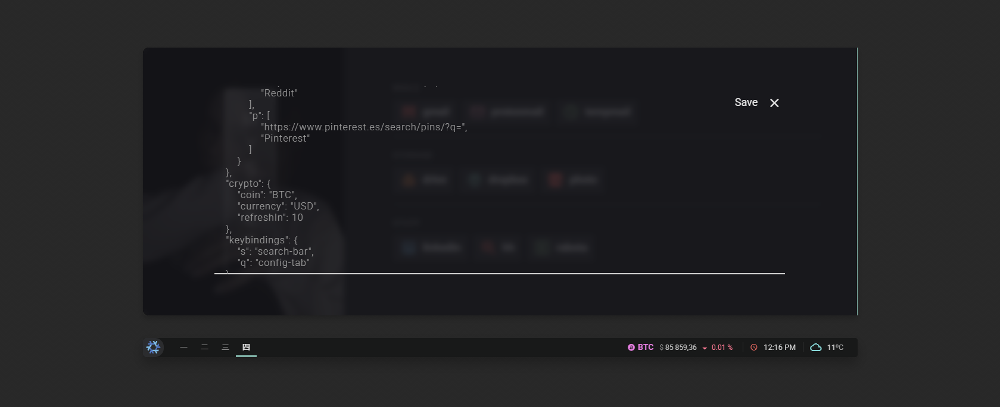

# Startpage Home-Dir


## ⌨️ Keybindings
| Hotkey                                            | Action                                  |
| ------------------------------------------------- | --------------------------------------- |
| <kbd>Numrow</kbd> \| <kbd>MouseWheel</kbd> \| <kbd>Click</kbd> | Switch tabs                |
| <kbd>s</kbd>                                      | Search Dialog                           |
| <kbd>q</kbd>                                      | Config Dialog (enable in userconfig.js) |
| <kbd>Esc</kbd>                                    | Close Dialogs                           |


## 🔍 Search Dialog


The search dialog allows you to display a search bar with various search engines defined in the configuration. To select each one, you simply need to prefix the query with the corresponding `!<id>`.
By default, the defined search engines are:
- `!g`: google
- `!d`: duckduckgo
- `!y`: youtube
- `!r`: reddit
- `!p`: pinterest


## ⚙️ Configuration Dialog


The default configuration file is [userconfig.js](userconfig.js), but you can change it in the configuration dialog. You can find more information about how the file works in the [original repository](https://github.com/b-coimbra/dawn). The available components are tabs, a clock, and weather.


## ⬇️ Installation and Setup

This project is designed for ease of use. Simply download and open in a browser. No server-side setup is required.

1. **Clone or Download:**
   - **Clone the Repository:**
     ```bash
     git clone https://github.com/kiroris/homedir
     ```
   - **Download as ZIP (Simpler for Users):**  Download the project as a ZIP file from the repository and extract it to a local folder.

2. **Open `index.html`:**  Navigate to the project folder and open the `index.html` file in your preferred web browser.  This will load the start page.

3. You can use the google extention  named `custom new Tab url` which allows you to set a local file as the startup page or you can direcly upload the project using github pages in your own repo using your custom configs :)


## 👤 Credits
- [Terminal127](https://github.com/Terminal127/tokyonight-startpage)
- [Taurus](https://github.com/AllJavi/tartarus-startpage)
- [Dawn](https://github.com/b-coimbra/dawn)